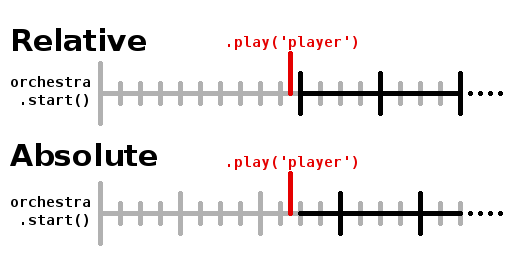

# Orchestre-JS


_Orchestre-JS_ is a web audio tool to create adaptive and interactive music.

- 🎶 **Vertical Layering:** Manage songs with several instruments and toggle them on and off
- 🎼 **Seamless Loops:** Play tracks in loop while keeping them in rhythm and preserving their decay
- 🥁 **Sync to the Beat:** Subscribe to events and trigger actions on the rhythm
- 🌊 **Syncopation:** Layer loops of different duration to create rich patterns
- ⏳️ **Scheduling:** Prepare the start and stop of instruments to make change just when you need to
- 💻️ **Developer Friendly:** Everything is done through code, no extra tool to learn
- ☁️ **Zero Dependency:** Works with all modern browsers
- 🌐 **Web Audio API Compatible:** Plug your music to any effects

Orchestre-JS is the perfect solution for **managing music in your web game or application**. Its modularity gives you the basic tools to play your music and design all kind of dynamic system around it. Its goal is to be easy to use, while powerful enough to support complex compositions.

[See the demo](https://clementrivaille.github.io/orchestre-js/) to learn all of its features.

You can also see it in action here:

- [Starseed Harmonies](https://itooh.itch.io/starseed-harmonies): A musical garden made with Svelte
- [Echoes Traveler](https://itooh.itch.io/echoes-traveler): Music exploration game made with Phaser
- [Blood Not Allowed](https://itooh.itch.io/blood-not-allowed): A musical story created with Twine

If you use Orchestre-JS in your creations, I would be really glad to see them! Feel free to show them to me.

## Install

### npm

```
npm install orchestre-js
```

### From file

Download the [latest release](https://github.com/ClementRivaille/orchestre-js/releases).

### Load

```javascript
import { Orchestre } from 'orchestre-js';
```

## Basic Usage

### Create an orchestra

The first thing you need is to create an _“Orchestre”_ (French for orchestra, as you've probably already figured). The only thing it needs is the song's BPM (beats per minute).

```javascript
const orchestra = new Orchestre(120);
```

### Add players

Then, you will need to register your song's separate tracks. In Orchestre-JS, those are called _Players_. Each player needs:

- A unique **name** that will identify it
- The **URL** of the sound file it will play
- The **length** in beats of the track
- An **absolute** boolean to tell how to position the player – for most cases you can set it to _true_ ([more explanation here](#player-position))

_Be aware that you need a local server to request files_.

The _length_ is the number of fourth notes in the track. For example, in a 4/4 signature, a track of one bar would have a length of 4, one of two bars would have 8, etc… You can also use a track of one bar and three beats (which gives a total of 7) and make it phases as it loops!

To add a single player, use:

```javascript
await orchestra.addPlayer('bass', './assets/music/bass.ogg', 16, true);
```

`addPlayer` returns a promise that resolves once the sound file has been fetched. A player can't be used until it is fully loaded.

However, you might want to use more than a single player! Therefore, you should use the `addPlayers` function, which takes an array of player configurations, and load them all:

```javascript
const players = [
  {
    name: 'chords',
    url: './assets/music/chords.ogg',
    length: 16,
    absolute: true,
  },
  {
    name: 'bass',
    url: './assets/music/bass.ogg',
    length: 16,
    absolute: true,
  },
  {
    name: 'guitar',
    url: './assets/music/guitar.ogg',
    length: 8,
  },
];

await orchestra.addPlayers(players);
```

You can add players at anytime, even once the orchestra has been started.

### Start the orchestra

Speaking of which, here is how it's done:

```javascript
orchestra.start();
```

This won't play any sound yet. But it will initiate a _metronome_, that will set the beginning of the music, and count each beat based on the BPM.

If you want to start with some tracks immediately, you can call `start` with an array of player names as parameter.

```javascript
orchestra.start(['bass', 'chords']);
```

### Activate players

Once the orchestra has been loaded, you can activate your players:

```javascript
orchestra.play('guitar');
```

To stop them, use:

```javascript
orchestra.stop('guitar');
```

Players will start and stop **on the next beat**. They will then stay in rhythm according to their type (relative or absolute). It's as simple as that!

You don't have to worry if your player is already playing or not. If you call `play` when a player is already active, or stop when it isn't, nothing will happen. Thus you can use `play` and `stop` to make sure the player is in the right state.

You can also call the function `toggle`, that just changes the player's state between play and stop.

```javascript
orchestra.toggle('guitar');
```

See below for more [playing options](#playing-options)

You now know the basics of Orchestre-JS. But it provides more tools to design a dynamic music system! Let's explore them.

## Features

### <a id="player-position"></a>Player position

What does the **absolute** player's option mean? By default, a player is _relative_, which means that **it will start playing from the beginning when it's called**, no matter where we are in the song. Absolute players, on the other hand, **will calculate their offset relatively from the start of the song**. As if they where already playing silently and their volume has been turned up.

Here is a diagram to better understand what absolute means. Each player here has a length of 4 beats, and are activated at the same time. See how the absolute player starts already in sync with the bar, while the relative one starts on its first beat.



Most of the time, you will want **absolute** players. They are guaranteed to stay aligned with each other, as they are playing on the bars of your song.

**Relative** players are useful for _stingers_: small melodic phrases played only once on an event (with the `once` option). But they can also be use for some complex generative compositions.

### <a id="playing-options"></a>Playing options

`play`, `stop` and `toggle` can take a second parameter _options_, which is an object that allows you to define some of those properties:

- **fade** _(float)_: time constant in seconds for a fade in or fade out. The length of fading is approximately equal to 1.6 times your constant. See [setTargetAtTime](https://developer.mozilla.org/en-US/docs/Web/API/AudioParam/setTargetAtTime) for more details.
- **now** _(bool)_: if true, sound will start / stop _immediately_ instead of waiting for next beat. This is better used with a fading.
- **once** _(bool)_: for _play_ only. Play the track only once (instead of a loop).
- **keep** _(bool)_: for _stop_ only. Keep playing the track until its completion, then stop looping.

### Scheduling

You can schedule a play/stop action on a player several beats in advance with the following method:

```javascript
orchestra.schedule('bass', 4, 'toggle'); // bass will be toggled after the next 4 beats
orchestra.schedule('guitar', 8, 'play', { absolute: true }); // guitar will play on the next bar of 8 beats
```

_Warning:_ Once an action has been scheduled, it can't be cancelled.

### Events

Orchestre-JS provide several methods for subscribing to the beat of the music.

To **subscribe to a beat interval**, use `addListener`. It takes a _callback_ and the _length_ of the interval in beats.

```javascript
// Called every beat
const listenerId = orchestra.addListener(() => {
  /* Do something */
}, 1);
// Called every 4 beats (starting from now)
const listenerId2 = orchestra.addListener(() => {
  /* Do something */
}, 4);
```

`addListener` takes also a second _options_ parameter:

- **absolute** _(bool)_: listen to absolute bars of n beats
- **offset** _(number)_: use with absolute to set a position in the bar

For example, `addListener(cb, 4, { absolute: true })`, will trigger on every bar of 4 beat, while `addListener(cb, 4, { absolute: true, offset: 1 })` will trigger on the second beat of the bars (index "1").

To remove a listener, use `removeListener` with its id:

```javascript
orchestra.removeListener(listenerId);
```

If you want to **trigger an event just once**, you can use the `wait` method. It takes the number of beats to wait, and the same options as `addListener`. It then returns a Promise that resolves once the beat is reached.

```javascript
await orchestra.wait(2); // Waits 2 beats
await orchestra.wait(4, { absolute: true }); // Waits for next bar of 4
await orchestra.wait(4, { absolute: true, offset: 2 }); // Waits for next 3rd beat in a bar
```

### Stop

Once you are done with your song, you can call `fullStop` on the orchestra to immediately stop all the instruments as well as its metronome.

```javascript
orchestra.fullStop();
```

The orchestra will need to be started to be used again.

## Accessibility

In order for your application to be accessible to anyone (including users with screen-readers), there are two important rules:

- User must have a way to stop or pause the sound
- User must have a control on the sound's volume

Orchestre-JS provides some functions that you can use in that order.

You can **pause the orchestra** by calling `orchestre.suspend()`, and start it again with `orchestre.resume()`. This will immediately interrupt all players and the metronome. Calling `resume` will make it start just where it was.

You can **change the volume** of the whole orchestre with `orchestre.setVolume(value)`, where _value_ is a float between 0 and 1 (or higher, but this is at your own risk). _Do not use this method for a fade out_ or any other effect. It has been intended for giving users a way to change volume, and therefore is applied immediately.

## Advanced

### Using the Web Audio API

Orchestre-JS uses the _Web Audio API_. You don't need to have experience with it to use Orchestre-JS. But knowing some if its basics can allow you to extend the possibilities that the lib offers. Here are some connecting options at your disposition.

By default, every new Orchestre creates its own audio context. But you can pass your own as a second argument.

```javascript
const context = new (window.AudioContext || window.webkitAudioContext)();
const orchestra = new Orchestre(120, context);
```

You can also access the audio context from the `context` property of the orchestra.

Players are by default connected to the orchestra's master gain (`orchestre.master`), which is connected to the context's destination. But if you want to **connect players to your own nodes**, you can change that with the `destination` parameter.

```javascript
await orchestra.addPlayer(
  'bass',
  './assets/music/bass.ogg',
  16,
  true,
  myAudioNode
);
// Or
await orchestra.addPlayers([
  {
    name: 'guitar',
    url: './assets/music/guitar.ogg',
    length: 8,
    destination: myAudioNode,
  },
]);
```

This allows you to **add effects on individual players** (like panning or reverb) or analyse their output.

Alternatively, you can also connect or disconnect players after they have been added:

```javascript
orchestra.connect('bass', myAudioNode);
orchestra.disconnect('bass', myAudioNode);
orchestra.disconnect('bass'); // Will disconnect from every nodes
```

_Warning_: If a player is not connected to `orchestre.master`, it is no longer affected by the `setVolume` method. The best practice is to connect your final node to `orchestre.master` so that it can be affected by the orchestra's volume.

```javascript
orchestra.connect('bass', myAudioNode);
myAudioNode.connect(orchestra.master);
```

### Metronome

Orchestre-JS orchestra uses a metronome to sync all tracks. In most use cases, you don't need to interact with it. But you can still access it from the `metronome` property of a created Orchestre.

The metronome gives you access to the property `beatsLength`, which is the length of a beat in seconds. _Beats_ are the tiniest unit of time calculated. By default, they correspond to fourth notes. If you want to be more precise, **the better is to multiply your BPM** (doubling the BPM for example will align beats to eighth notes).

Here are some metronome's methods you can use :

- `getNextBeatTime(): float` gives you the time, in second, of the next beat
- `getNextNthBeatTime(beats: number): float` gives you the time, in second, of the next nth beat
- `getOffset(time: float): float` gives in seconds the offset of the given time relatively to the closest beat before it
- `getBeatPosition(time: float, barSize: number): number` for absolute bars of _barSize_ beats, gives the position of the given time. For example, for a bar of 4 beat, results may go from 0 (first beat) to 3 (last beat).

For the simple tasks though (such as counting the position in a bar), I would advise not to use these functions and instead use the `addListener` method on the orchestra to manage your own counters.

## API

[API Documentation](doc/api.md)

## Troubleshooting

- **My players loop too early / too late**: Make sure that the BPM you provided to your Orchestre matches your song's one, and that you wrote the correct number of beats in your loop in the player's _length_. For example, 4 bars in 4/4 will have a length of 16. Orchestre will use these values to loop your tracks, regardless of the audio file's actual length. This allows not only to keep them synchronized to the rhythm, but also to make them overlap if they have reverb or delay at the end.
- **My audio files don't play:** Make sure that you wrote the correct folder and name in the _url_ property of the player, and that this file is accessible. You can check its download in your browser's devtools. If you see another error in the console, refer to the Web Audio API documentation. Some browser might not accept all formats! You should be safe with .ogg, .wav or .mp3 though.
