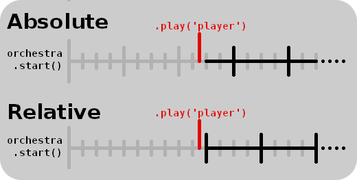

# Orchestre-JS


Audio tool to create adaptive and interactive music.

[View demo](https://clementrivaille.github.io/orchestre-js/)

Orchestre-JS is an audio library for managing music loops with several layers. It can be used to dynamically add and remove instruments in a song, play sounds in rhythm, transitioning through verses, or call events on beats. Orchestre-JS aims to provides a simple way to create dynamic soundtracks for your web games or applications.

Orchestre-JS has no external dependencies and uses only the native Web Audio API. It should be compatible with most modern browsers. You can also plug it to custom audio applications (see the [Web Audio API](#using-the-web-audio-api) section).

If you want to see the library in action, you can check out those games: [Echoes Traveler](https://itooh.itch.io/echoes-traveler), [Blood Not Allowed](https://itooh.itch.io/blood-not-allowed) (made with Twine), and [Step Out](https://itooh.itch.io/step-out).
If you use Orchestre-JS in your creations, I would be really glad to see them! Feel free to show them to me.

## Install

### npm

```
npm install orchestre-js
```

### From file

Download the [latest release](https://github.com/ClementRivaille/orchestre-js/releases).

### Load

```javascript
import { Orchestre } from 'orchestre-js';
// or
const { Orchestre } = require('orchestre-js');
```

## How to use

### Create an orchestra

The first thing you need is to create an _“orchestre”_ (French for orchestra, if you hadn't figured it out yet). The only thing it needs is the song's BPM (beats per minute).

```javascript
const orchestra = new Orchestre(120);
```

### Add players

Then, you will need to add some players. Each player corresponds to one track. For one player, you need:

- A unique **name** that will identify it
- The **URL** of the sound file it will play
- The **length** in beats of the track
- An optional **absolute** boolean if you want the track to be played on bars

_Be aware that you need a local server to request files_.

For example, in a 4/4 signature, a track of one bar would have a length of 4, two bars would be 8, etc… But you can also use a track of one bar and three beats (7) and make it phase as it loops!

What does the **absolute** option means? By default, a player is relative, which means that it will play from its track beginning when it starts, no matter where we are in the song. Absolute players, on the other hand, will calculate their offset relatively from the start of the song. Which mean that every absolute players will always play together. This is useful for players that set the chords or main melodies, generally playing several bars.

Here is a diagram to better understand what absolute means. Each player here has a length of 4 beats, and are activated at the same time. See how the relative one starts right on the first beat, while the absolute one starts from the second beat.


To add a single player, use:

```javascript
await orchestra.addPlayer('bass', './assets/music/bass.ogg', 16, true);
```

`addPlayer` returns a promise that resolves once the sound file has been fetched. A player can't be used until being fully loaded.

However, you might want to use more than a single player! Therefore, you should use the `addPlayers` function, which takes an array of player configurations, and load them all:

```javascript
const players = [
  {
    name: 'chords',
    url: './assets/music/chords.ogg',
    length: 16,
    absolute: true,
  },
  {
    name: 'bass',
    url: './assets/music/bass.ogg',
    length: 16,
    absolute: true,
  },
  {
    name: 'guitar',
    url: './assets/music/guitar.ogg',
    length: 8,
  },
];

await orchestra.addPlayers(players);
```

You can add players at anytime, even once the orchestra has been started.

### Start the orchestra

Speaking of which, here is how it's done:

```javascript
orchestra.start();
```

This won't play any sound yet. But it will initiate a metronome, that will set the beginning of the music, and count each beat based on the BPM.

However if you want to start with some tracks immediately, you can call `start` with an array of player names as parameter.

```javascript
orchestra.start(['bass', 'chords']);
```

### Activate players

Once the orchestra has been loaded, you can activate your players:

```javascript
orchestra.play('guitar');
```

And to stop them:

```javascript
orchestra.stop('guitar');
```

Players will start and stop on the next beat, and automatically stay in rhythm, according to their type (relative or absolute). It's as simple as that!

You don't have to worry if your player is already playing or not. If you call `play` when a player is already active, or stop when it isn't, nothing will happen. Thus you can use `play` and `stop` to make sure the player is in the right state.

You can also call the function `toggle`, that just changes the player position between play and stop.

```javascript
orchestra.toggle('guitar');
```

`play`, `stop` and `toggle` can take a second parameter _options_, which is an object that allows you to define some of those properties:

- **fade** _(float)_: time constant in seconds for a fade in or fade out. The length of fading is approximately equal to 1.6 times your constant. See [setTargetAtTime](https://developer.mozilla.org/en-US/docs/Web/API/AudioParam/setTargetAtTime) for more details.
- **now** _(bool)_: if true, sound will start / stop immediately instead of waiting for next beat. This is better used with fading.
- **once** _(bool)_: for _play_ only. Play sound only once (instead of a loop), then stop.
- **keep** _(bool)_: for _stop_ only. Keep playing the sound until its completion then stop looping.

Finally, you can schedule an action on a player several beats in advance with the following method:

```javascript
orchestra.schedule('bass', 4, 'toggle'); // bass will be toggled after the next 4 beats
orchestra.schedule('guitar', 8, 'play', { absolute: true }); // guitar will play on the next bar of 8 beats
```

_Warning:_ Once an action has been scheduled, it can't be cancelled.

### Trigger events

To wait one or more beat before executing an event, you can use the `wait` method:

```javascript
await orchestra.wait(2); // Waits 2 beats
```

`wait` takes also a second _options_ parameter:

- **absolute** _(bool)_: wait for the next bar of n beats
- **offset** _(number)_: use with absolute to set a position in the bar

If you want to regularly perform an action, use `addListener`. It takes a callback, the length of the interval in beats, and the same options as _wait_. Here is how to call an event at the third note of every bar of 4 beats:

```javascript
const listenerId = orchestra.addListener(
  () => {
    /* Do something */
  },
  4,
  {
    absolute: true,
    offset: 2,
  }
);
```

To remove a listener, use `removeListener` with its id:

```javascript
orchestra.removeListener(listenerId);
```

### Stop

Once you are done with your song, you can call `fullStop` on the orchestra to immediately stop all the instruments, and stop the metronome.

```javascript
orchestra.fullStop();
```

Note that the orchestra will need to be started to be used again.

That's it! You know all the basics of Orchestre-JS.

## Accessibility

In order for your application to be accessible to anyone (including users with screen-readers), there are two important rules:

- User must have a way to stop or pause the sound
- User must have a control on the sound's volume

Orchestre-JS provides some functions that you can use in that order.

You can pause your orchestra by calling `orchestre.suspend()`, and start it again with `orchestre.resume()`. This will immediately interrupt all players and the metronome. Calling `resume` will make it start just where it stopped.

You can change the volume of the whole orchestre with `orchestre.setVolume(value)`, where value is a float between 0 and 1 (or higher, but this is at your own risk). _Do not use this method for a fade out_ or any other effect. It has been intended for giving users a way to change volume, and therefore is applied immediately.

## Advanced

### Using the Web Audio API

Orchestre-JS uses the _Web Audio API_. You don't need to know how to use it to use Orchestre-JS, but as always, it can help.
If you're more advanced with the Web Audio API, you might want to have some more complex usage of Orchestre-JS. Here are some options at your disposition.

By default, every new orchestra creates its own audio context. But you can pass your own as a second argument.

```javascript
const context = new (window.AudioContext || window.webkitAudioContext)();
const orchestra = new Orchestre(120, context);
```

You can also access the audio context from the `context` property of the orchestra.

Players are by default connected to the orchestra's master gain (`orchestre.master`), which is connected to the context's destination. But if you want to connect them to your own node (for example to add a reverb effect), you can change that with the `destination` parameter.

```javascript
await orchestra.addPlayer(
  'bass',
  './assets/music/bass.ogg',
  16,
  true,
  myAudioNode
);
// Or
await orchestra.addPlayers([
  {
    name: 'guitar',
    url: './assets/music/guitar.ogg',
    length: 8,
    destination: myAudioNode,
  },
]);
```

Alternatively, you can connect or disconnect players dynamically:

```javascript
orchestra.connect('bass', myAudioNode);
orchestra.disconnect('bass', myAudioNode);
orchestra.disconnect('bass'); // Will disconnect from every nodes
```

_Warning_: If a player is not connected to master, it is no longer affected by the `setVolume` method. The best practice is to connect your final node to `orchestre.master` so that it can be affected by the orchestra's volume.

```javascript
orchestra.connect('bass', myAudioNode);
myAudioNode.connect(orchestra.master);
```

### Metronome

Orchestre-JS orchestra uses a metronome to sync all tracks. In most use cases, you don't need to interact with it. You can still access it from the `metronome` property of a created Orchestre.

The metronome gives you access to the property `beatsLength`, which is the length of a beat in seconds. _Beats_ are the tiniest unit of time calculated. If you want to be more precise, the better is to adapt your BPM (like setting it to the double of the actual BPM to count eighth notes).

Here are some metronome's methods you can use :

- `getNextBeatTime(): float` gives you the time, in second, of the next beat
- `getNextNthBeatTime(beats: number): float` gives you the time, in second, of the next nth beat
- `getOffset(time: float): float` gives in seconds the offset of the given time relatively to the closest beat before it
- `getBeatPosition(time: float, barSize: number): number` for absolute bars of _barSize_ beats, gives the position of the given time. For example, for a bar of 4 beat, results may go from 0 (first beat) to 3 (last beat).

For the simple tasks though (such as counting the position in a bar), I would advise not to use these functions and instead use the `addListener` method on the orchestra to manage your own counters.

## API

[API Documentation](doc/api.md)

## Troubleshooting

- **My players loop too early / too late**: Make sure that the BPM you provided to your Orchestre matches your song's one, and that you wrote the correct number of beats in your loop in the player's _length_. For example, 4 bars in 4/4 will have a length of 16. Orchestre will use these values to loop your tracks, and ignore their actual length. This allows not only to keep them synchronized to the rhythm, but also to make them overlap if they have reverb or delay at the end.
- **My audio files don't play:** Make sure that you wrote the correct folder and name in the _url_ property of the player, and that this file is accessible. You can check its download in your browser's devtools. If you see another error in the console, refer to the Web Audio API documentation. Some browser might not accept all formats! You should be safe with .ogg, .wav or .mp3 though.
